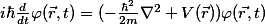

# 随想-开篇
#### *161001*

　　在一周之前，我在知乎上看到个人也能申请微信公众号，怀着好奇的心思就自己也注册了一个。当时想的好好的，就当做一个能够发随想日记的地方。但是，这样美好的想法在我身上，往往就不那么容易执行下去，公众号的荒废估计也只在未来可期的那么几天了。这样的坏结果我估计我内心在刚开始的时候就已经有了预测。它像是一种习惯性的放弃，激起的只有一时的兴趣，一想到自己的时间又要被分出去做这个事情了，就不那么乐意了。

　　也是因为经历了那么多次的失败（其实是自己懒惰），今天我还是打算写一点东西，好歹挽回一下这个公众号的颓势。写的东西呢，也就是我创立这个公众号所考虑的初衷，<em><u>日记、感想</u></em>。
   
    

 

  　　16年十一，我也算是享受上开学以来算是最大的一个假期了。这之前的一个礼拜可以说是很忙碌的。如今大三的物理核心专业课——电动力学、量子力学——的难度较之前两年的那些课程，有了一个质的飞跃。这倒也不是什么褒奖，说它是质的飞跃，原因其实就是它和数学结合得更为紧密了。

　　　区别于力热光电，四大力学更偏向于定量，或者说更为明确。无论是理论、公式都要比之前的来的严谨，当然也更为复杂晦涩。不过，难度的提升也是非常正常的。简单地说，由于之前两年的基础铺垫，我们对于基础的物理学思维有了基本的概念，还有一个非常重要的因素是两年的数学学习。这两个方面都是为了之后四大力学的学习而准备的基础。

　　主观上来讲，物理本来就不是一门轻易能学懂的学科，学物理的人需要对于物理知识有非常好的理解力。客观上，物理又是与诸多领域密不可分的一门学科，尤其是数学。随着物理与数学的不断发展，笛卡尔坐标的引进、黎曼几何的出现，这些都推动了物理学的发展。这些公式与模型逐渐地把物理中定量的这个部分完善起来。场论群论不提，不说这些内容我还没有学过，就算学也不容易学好。解各种微分方程、傅里叶变换就够我花很多时间去吸收消化了。

　　物理就是这么一个磨人的小妖精，在初高中时期，它可以算得上是最吸引人的一门课程，最有意思的一门课。但是到了大学，在专业的物理学习过程中，你会发现 \_(:з」∠)\_，这些东西是什么鬼(╯‵□′)╯︵┻━┻。大学的物理（除了大学物理或者叫基础物理）就不再如之前那么温顺了，它显得更加难懂，更加神秘，某种程度上也更为美丽。

　　物理的学习也许就是这样，看了半天，心中只剩下WTF，这破书不看了。但是突然又会有一种迷之冲动，想找个美好的地方，静静地刷上半天一天的量子力学。有一句话说得好：

 

  <em> I don't need sex, 'cuz physics **fucks** me everyday. </em>

    

 *还有什么比~~雾里~~更有趣的呢？*

